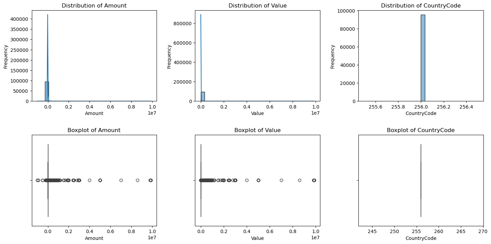
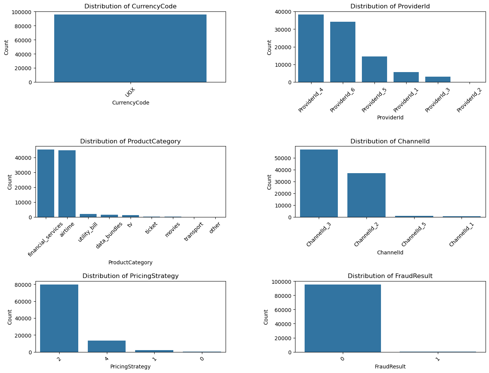
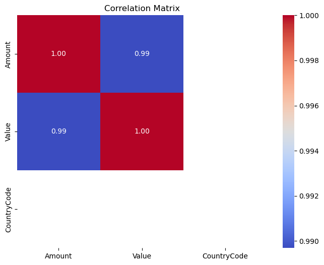
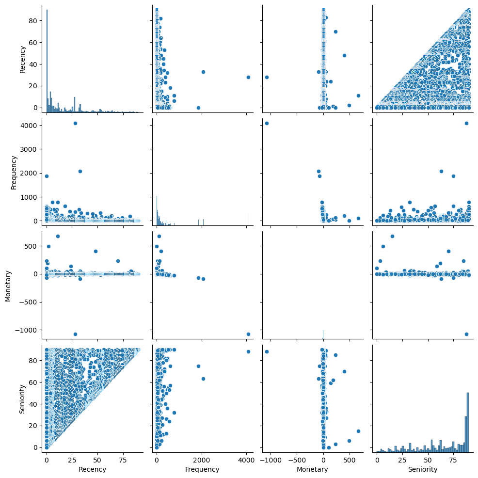
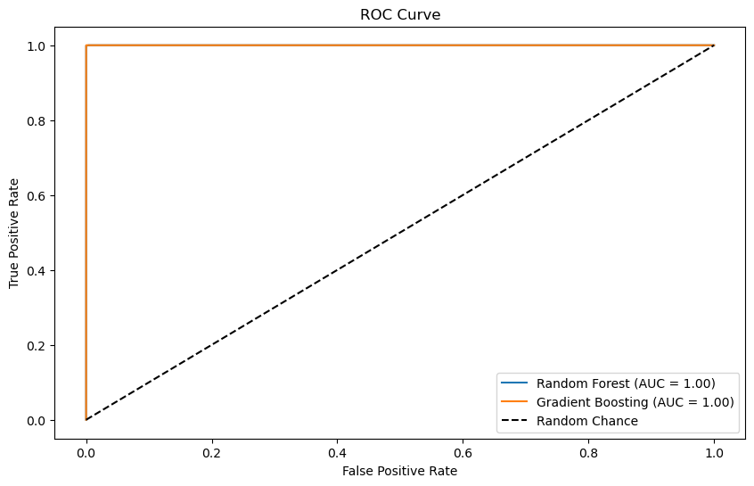
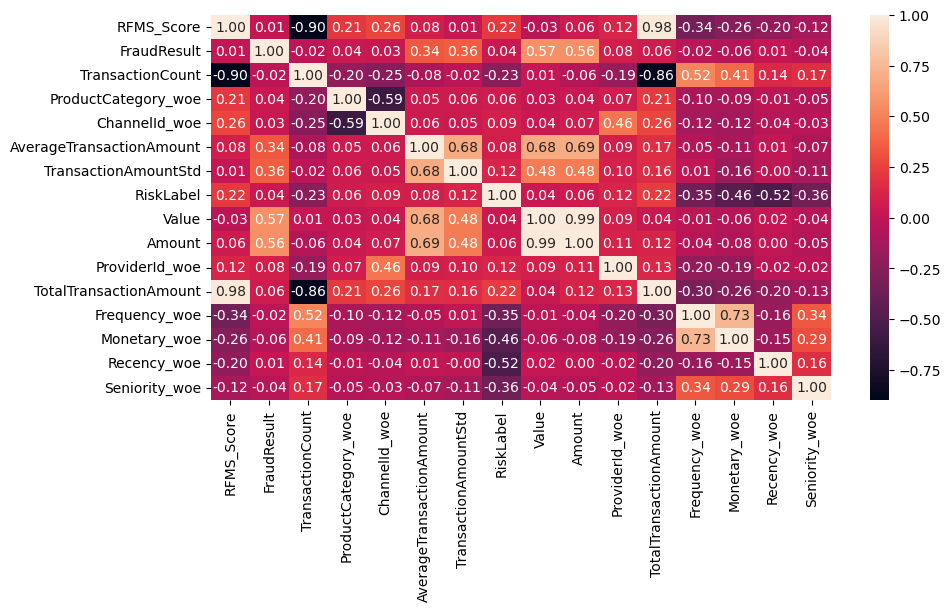

# Credit Scoring Model: Data Processing, EDA, Feature Engineering, and Model Training

## Project Overview

This project aims to build a **Credit Scoring Model** for a *Buy-Now-Pay-Later (BNPL)* service in collaboration with an eCommerce platform. The dataset consists of transaction-level records, and the objective is to analyze customer behavior, engineer meaningful features, and develop machine learning models to predict **credit risk**.


## Prerequisites

Before running the notebooks, ensure you have the following installed:

* Python 3.x
* Jupyter Notebook or JupyterLab
* Required Python libraries (listed in `requirements.txt`)


## Environment Setup

Follow these steps to set up the project locally:

### 1. Clone the Repository

```bash
git clone https://github.com/MAYSHLMAY/insurance-risk-analytics-acis.git
```

### 2. Install Dependencies

```bash
pip install -r requirements.txt
```

### 3. Launch Jupyter Notebook

```bash
jupyter notebook
```

From the Jupyter interface, open any of the notebooks inside the `scripts/` or `notebooks/` directories.

---

## Notebook Descriptions

### 📌 Data Preprocessing

* **Notebook**: `data_cleaning.ipynb`
* **Objective**: Prepare raw transaction data for analysis and modeling.

**Key Steps:**

1. Load data from CSV or similar formats
2. Inspect data structure using `info()`
3. View sample records with `head()`
4. Verify column names
5. Identify missing values
6. Remove duplicate entries
7. Convert `transactionstarttime` to datetime format
8. Handle invalid or missing datetime values
9. Review cleaned data
10. Save the processed dataset

---

### 📊 Exploratory Data Analysis (EDA)

* **Notebook**: `EDA.ipynb`
* **Objective**: Understand data distributions, relationships, and patterns.

**Includes:**

* Summary statistics for numerical features
* Distribution visualizations (histograms, box plots)
* Correlation analysis using heatmaps
* Categorical feature analysis
* Time-based trend analysis
* Outlier detection and interpretation







### 🧠 Feature Engineering

* **Notebook**: `Feature_Engineering.ipynb`
* **Objective**: Enhance predictive power through meaningful features.

**Key Tasks:**

* Aggregate transaction-level features (total, average, count, standard deviation)
* Extract time-based features (hour, day, month, year)
* Encode categorical variables using **Weight of Evidence (WoE)**
* Handle missing values
* Normalize or standardize numerical features

---

### 📐 Default Estimator & WoE Binning

* **Notebook**: `Default_Estimator_and_WOE_Binning.ipynb`
* **Objective**: Apply RFMS-based risk modeling and WoE transformations.

**Processes:**

* RFMS feature construction (Recency, Frequency, Monetary, Seniority)
* Risk label assignment (Good vs Bad customers)
* WoE binning of RFMS features
* Information Value (IV) calculation to evaluate feature importance

**Visualization Example:**


*RFMS-based default estimator feature visualization*

### 🤖 Model Training

* **Notebook**: `Modelling.ipynb`
* **Objective**: Train and evaluate machine learning models.

**Includes:**

* Model selection (Random Forest, Gradient Boosting)
* Train-test data splitting
* Hyperparameter tuning (Grid Search, Random Search)
* Cross-validation to prevent overfitting
* Model evaluation using Accuracy, Precision, Recall, F1-score, and ROC-AUC





## Project Structure

```
├── .vscode/
│   └── settings.json
├── .github/
│   └── workflows/
│       └── unittests.yml
├── app/
│   ├── main.py
│   └── requirements.txt
├── notebooks/
│   ├── __init__.py
│   ├── EDA.ipynb
│   ├── Feature_Engineering.ipynb
│   ├── Modelling.ipynb
│   └── Default_Estimator_and_WOE_Binning.ipynb
├── scripts/
│   ├── __init__.py
│   └── data_cleaning.ipynb
├── src/
│   └── __init__.py
├── tests/
│   └── __init__.py
├── Dockerfile
├── .dockerignore
├── .gitignore
├── README.md
└── requirements.txt
```

---

## Contributing

To contribute to this project:

1. Fork the repository
2. Create a new branch

   ```bash
   git checkout -b feature-branch
   ```
3. Commit your changes

   ```bash
   git commit -am "Add new feature"
   ```
4. Push to GitHub

   ```bash
   git push origin feature-branch
   ```
5. Open a Pull Request


## License

This project is licensed under the **MIT License**. See the `LICENSE` file for more details.
